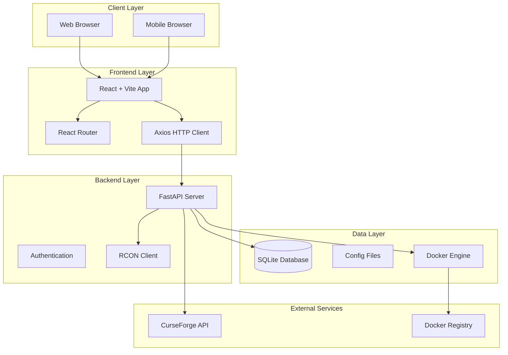

# Design Document

## Overview

ContainerCraft follows a modern web application architecture with a React frontend and FastAPI backend, leveraging Docker for Minecraft server containerization. The system integrates with the CurseForge API for modpack discovery and uses intelligent configuration parsing to generate adaptive user interfaces. The architecture prioritizes simplicity, cross-platform compatibility, and real-time server management capabilities.

## Architecture

### High-Level Architecture



### Technology Stack Integration

- **Frontend**: React 18 with Vite for fast development and building
- **Backend**: FastAPI with async/await patterns for high performance
- **Database**: SQLite with SQLAlchemy ORM for simple deployment
- **Containerization**: Docker Python SDK for container lifecycle management
- **RCON**: mcrcon library for Minecraft server communication
- **Styling**: Tailwind CSS for responsive, mobile-first design

## Components and Interfaces

### Frontend Components

#### Core Components
- **ModpackBrowser**: CurseForge modpack discovery and selection interface
- **ServerDashboard**: Multi-server overview with status monitoring
- **ConfigurationPanel**: Dynamic configuration interface with adaptive controls
- **DeploymentWizard**: Step-by-step server deployment process
- **RconTerminal**: Command interface for server management
- **ConfigurationManager**: Save/load configuration templates

#### Shared Components
- **ServerCard**: Reusable server status display component
- **ConfigControl**: Dynamic form control factory (slider, toggle, input)
- **StatusIndicator**: Real-time server status visualization
- **ProgressBar**: Deployment and operation progress tracking

### Backend Services

#### API Endpoints Structure
```
/api/v1/
├── modpacks/
│   ├── GET /search          # Search CurseForge modpacks
│   ├── GET /{id}           # Get modpack details
│   └── GET /{id}/versions  # Get modpack versions
├── servers/
│   ├── GET /               # List all servers
│   ├── POST /              # Deploy new server
│   ├── GET /{id}           # Get server details
│   ├── PUT /{id}/config    # Update server configuration
│   ├── POST /{id}/start    # Start server
│   ├── POST /{id}/stop     # Stop server
│   └── DELETE /{id}        # Remove server
├── configs/
│   ├── GET /               # List saved configurations
│   ├── POST /              # Save new configuration
│   ├── GET /{id}           # Get configuration details
│   └── DELETE /{id}        # Delete configuration
└── rcon/
    └── POST /{server_id}/command  # Execute RCON command
```

#### Service Layer Architecture
- **ModpackService**: CurseForge API integration and caching
- **DockerService**: Container lifecycle management
- **ConfigService**: Configuration parsing and validation
- **RconService**: Minecraft server communication
- **DatabaseService**: Data persistence and retrieval

## Data Models

### Database Schema

```python
# Server Instance Model
class ServerInstance:
    id: UUID
    name: str
    modpack_id: int
    modpack_version: str
    container_id: str
    status: ServerStatus
    port: int
    rcon_port: int
    rcon_password: str
    created_at: datetime
    updated_at: datetime
    configuration_id: Optional[UUID]

# Configuration Template Model
class ConfigurationTemplate:
    id: UUID
    name: str
    description: str
    modpack_id: int
    config_data: JSON
    created_at: datetime
    is_default: bool

# Configuration Entry Model
class ConfigurationEntry:
    id: UUID
    server_id: UUID
    file_path: str
    key: str
    value: str
    value_type: ConfigType
    ui_control: UIControlType
    min_value: Optional[float]
    max_value: Optional[float]
    options: Optional[List[str]]
```

### Configuration Parsing Logic

The system implements intelligent configuration parsing to determine appropriate UI controls:

```python
class ConfigParser:
    def determine_ui_control(self, key: str, value: Any, context: dict) -> UIControl:
        # Boolean values -> Toggle
        if isinstance(value, bool):
            return UIControl(type="toggle", current=value)
        
        # Numeric values with known ranges -> Slider
        if isinstance(value, (int, float)) and self.has_known_range(key):
            min_val, max_val = self.get_range(key)
            return UIControl(type="slider", current=value, min=min_val, max=max_val)
        
        # Enum-like values -> Dropdown
        if key in self.known_enums or self.detect_enum_pattern(value, context):
            options = self.get_enum_options(key, context)
            return UIControl(type="dropdown", current=value, options=options)
        
        # Default -> Text Input
        return UIControl(type="input", current=str(value))
```

## Error Handling

### Frontend Error Handling
- **Network Errors**: Retry logic with exponential backoff
- **Validation Errors**: Real-time form validation with user feedback
- **Server Errors**: User-friendly error messages with technical details in console
- **State Management**: Error boundaries to prevent application crashes

### Backend Error Handling
- **Docker Errors**: Container operation failures with cleanup procedures
- **CurseForge API Errors**: Rate limiting and fallback mechanisms
- **Configuration Errors**: Validation with detailed error messages
- **RCON Errors**: Connection retry logic and status reporting

### Error Response Format
```json
{
  "success": false,
  "error": {
    "code": "DOCKER_DEPLOYMENT_FAILED",
    "message": "Failed to create container",
    "details": "Port 25565 is already in use",
    "timestamp": "2024-01-15T10:30:00Z"
  }
}
```

## Testing Strategy

### Frontend Testing
- **Component Testing**: React Testing Library for component behavior
- **Integration Testing**: API integration testing with mock backends
- **E2E Testing**: Cypress for critical user workflows
- **Responsive Testing**: Cross-device and cross-browser compatibility

### Backend Testing
- **Unit Testing**: pytest for service layer and utility functions
- **API Testing**: FastAPI TestClient for endpoint testing
- **Integration Testing**: Docker container testing in isolated environments
- **Performance Testing**: Load testing for concurrent server management

### Testing Environments
- **Development**: Local Docker Compose setup
- **CI/CD**: GitHub Actions with containerized testing
- **Staging**: Production-like environment for final validation

## Security Considerations

### Authentication & Authorization
- **Session Management**: JWT tokens for API authentication
- **RCON Security**: Secure password generation and storage
- **Docker Security**: Limited container privileges and network isolation

### Data Protection
- **Configuration Security**: Sensitive values encrypted at rest
- **Network Security**: HTTPS enforcement and secure WebSocket connections
- **Input Validation**: Comprehensive sanitization of user inputs

## Performance Optimization

### Frontend Performance
- **Code Splitting**: Route-based lazy loading
- **Caching**: API response caching with React Query
- **Optimization**: Vite build optimization and tree shaking

### Backend Performance
- **Async Operations**: FastAPI async patterns for I/O operations
- **Database Optimization**: SQLAlchemy query optimization and connection pooling
- **Caching**: Redis integration for frequently accessed data

### Resource Management
- **Container Limits**: Docker resource constraints for server containers
- **Monitoring**: Real-time resource usage tracking
- **Cleanup**: Automatic cleanup of stopped containers and unused resources